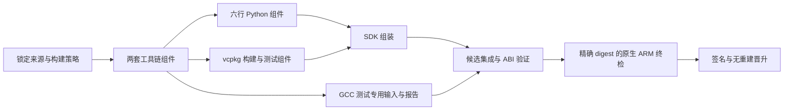

# Crossforge 项目现状与 CI 重构分析

Crossforge 已有相当完整的工具链、ABI、Python 和供应链校验实现，但从日常提交到可信交付的路径仍不稳定。当前最值得重构的是 CI 调度、组件交接与资格验证的组织方式。现有证据不足以支持再做一次全项目语言重写。

六项核心路线已完成逐项讨论并确认。落地依赖、批次范围和验收条件已整理为[分批实施方案](/home/eg/workspace/github/eglinux/crossforge/docs/research/ci-refactoring-plan-2026-09-10.md)。本文保留分析基线与当时的实测依据；后续代码改造状态见[实施进度](/home/eg/workspace/github/eglinux/crossforge/docs/research/ci-refactoring-progress.md)。

分析以 `cf736eab8aa53b851874509d66676e5bac98dc27` 为代码基线，结合 2026 年 9 月 8–10 日的 GitHub Actions 记录。该提交对应的新候选流程在最后一次查询时仍为 pending，不能把较早提交的成功或失败当作它的结果。完整测量口径、运行链接、job 数据、日志摘要和校验结果保存在[观测数据](/home/eg/workspace/github/eglinux/crossforge/docs/research/ci-architecture-observations-2026-09-10.json)。这些是分析资料，不是发布资格证据。

## 1. 项目处于什么阶段

产品方向清楚：在一个 linux/amd64 SDK 中，提供面向 EL8 的 x86_64、aarch64 两套真正交叉工具链，以及 CPython 3.9–3.14 的 build/target SDK、构建系统集成和 DEB/RPM 分包。产品的难点主要是不同平台角色、运行库来源和资格证据的严格区分。[架构契约](/home/eg/workspace/github/eglinux/crossforge/docs/architecture.md:8)

已有实现值得保留的部分包括：

| 领域 | 已有基础 | 评估 |
|---|---|---|
| 依赖与来源 | DNF transaction、实收 RPM lock、签名和源代码绑定 | 产品可信度的重要基础 |
| 工具链 | GTS SRPM vendor patches、两套 cross compiler、hybrid runtime | 核心差异化能力，应保留构建语义 |
| ABI | 冻结符号集合、ELF 属性、provider ownership、loader closure | 正确性约束较强，不适合为提速直接删减 |
| Python | 六个 minor，三个 adapter，每行两套 target SDK | 已完成大量兼容性工作；矩阵成本真实存在 |
| 集成与分包 | CMake/Meson/vcpkg、严格 Crosspack、nFPM 后端 | 有用户价值，但与 compiler build 的调度边界偏粗 |
| 发布 | candidate、原生 ARM 探针、签名、digest-only promotion、rollback | 代码路径较完整，端到端运行实证仍不足 |

宿主机预检查执行了 956 项 config/packaging 测试，153.9 秒完成，零失败、零错误，3 项因缺少真实 zstd 资源或 nFPM 跳过。随后已使用 Docker 重新执行测试，并完成实际 Bake 构建；容器结果与试点范围见第 14 节。锁定配置、供应链证据、冻结 ABI、Python runtime providers，以及三个 renderer 的 `--check` 均通过。这说明已有大量可依赖的回归保护；它不等同于重跑 compiler、QEMU、完整 SDK 或原生 ARM 资格化。

仓库有 651 个跟踪文件。`scripts/` 125 个文件、约 5.62 万行；`tools/` 7 个文件、约 0.31 万行；`tests/` 139 个文件、约 3.25 万行。行数包含注释和空行，不是有效代码行统计。复杂度主要集中在内部构建与证据系统，而用户 CLI 本身较小。

重点大文件包括 `finalize-cpython-qualification.py` 2354 行、`validate-rpm-lock.py` 2184 行、`crosspack.py` 1929 行、`release-components-core.py` 1896 行、主 Dockerfile 1876 行、`render-bake.py` 1729 行。大文件本身不能证明设计错误，但反映出维护者需要同时理解配置投影、文件布局、构建图和证据 schema，修改成本较高。

发布成熟度需要单独看待。查询时 Releases API 没有返回可见 release；最近 40 条 workflow 记录中，18 条是 candidate：7 次失败、10 次取消、1 次 pending，没有成功候选。这是近期样本，不能推导全部历史的成功率。架构文档也承认首次稳定晋升仍缺运行实证。因此，更准确的状态是“核心功能和校验大量实现，持续交付闭环尚待证明”。

## 2. Actions 时间花在哪里

选取 Qt 已退出默认流程后的四次完成运行：

| 运行 | 源提交 | 总墙钟时间 | job 耗时之和 | 主要失败点 |
|---|---|---:|---:|---|
| [34309161320](https://github.com/eglinuxer/crossforge/actions/runs/34309161320) | e31bf2c | 8 小时 21 分 | 16.78 小时 | SDK |
| [34352938456](https://github.com/eglinuxer/crossforge/actions/runs/34352938456) | 17f2693 | 7 小时 34 分 | 15.62 小时 | SDK |
| [34401171599](https://github.com/eglinuxer/crossforge/actions/runs/34401171599) | a4cec5a | 8 小时 22 分 | 16.94 小时 | GCC full baseline |
| [34415119472](https://github.com/eglinuxer/crossforge/actions/runs/34415119472) | 7d534b6 | 13 小时 37 分 | 16.80 小时 | source bundle metadata |

总墙钟时间按 API 的 `updated_at - created_at` 计算；job 耗时之和包含并行 job 和准备/收尾时间，不是 CPU 时间，也不是账单费用。四次运行的 workload 和缓存状态不完全相同，不能作为严格控制变量的性能实验。

最后一次完成运行的关键路径如下。所有时间均为 UTC：

| 阶段 | 起止或跨度 | 耗时 |
|---|---|---:|
| Quick 及其结果汇总 | 9 月 9 日 23:02–23:12 | 约 10 分钟 |
| 等待 qualification 接入 | 23:12–次日 04:50 | 约 5 小时 38 分钟 |
| Qualification preflight | 04:50–04:57 | 7.6 分钟 |
| Inputs | 04:57–05:04 | 6.7 分钟 |
| 两个 toolchain job | 05:04–05:34 | 最慢 29.7 分钟 |
| 六行 Python，最多同时两行 | 05:34–08:56 | 跨度 202.4 分钟 |
| vcpkg，与 Python 并行 | 05:34 开始 | 142.9 分钟 |
| GCC full，与 Python 并行 | 05:34 开始 | 130.4 分钟 |
| SDK | 08:56–12:30 | 213.7 分钟 |
| Publish | 12:30–12:39 | 8.6 分钟后失败 |

因此，13 小时多不能全部归因于编译。这个样本同时存在排队、Python 矩阵受限和 SDK 重复工作三个主要因素。

近期的 Qt 调整确实有意义。9 月 8 日较早一次运行的 Qt WebEngine job 用了约 299 分钟，后续 Qt host 又在约 330 分钟处失败。但上表四次运行已跳过 Qt，仍需 7.5–13.6 小时，继续讨论默认 CI 时应把 Qt 移出主要嫌疑范围。

## 3. 第一优先级：重新定义什么事件值得跑完整交付

**已确定的方案：main 做增量验证，手动或准备发布时生成完整候选。** 以下保留现状与取舍依据；本次讨论尚未修改工作流。落地必须同时修改触发入口与受影响组件选择。

目前 `candidate.yml` 在每次 main push 时启动，先 quick，再无条件调用完整 qualification，之后才 publish。`qualification.yml` 自己又每日执行，并与候选预资格化共享 `crossforge-qualified-cache` 全局并发组。[candidate 入口](/home/eg/workspace/github/eglinux/crossforge/.github/workflows/candidate.yml:7)、[共享队列](/home/eg/workspace/github/eglinux/crossforge/.github/workflows/qualification.yml:21)

这种设计保证同名可变 cache tag 不被多个 writer 同时覆盖，但把整个重型 qualification 串行化了。每个修日志、修工作流、修发布脚本的小提交，都可能排入数小时的完整编译与测试队列。每日任务还会消耗相同的执行通道。7d534b6 的改动只有 GCC 诊断脚本和测试，共 29 行，依然走了完整候选路径。

GitHub 官方说明，`queue: max` 允许最多 100 个待执行 job/run，且不能与 `cancel-in-progress: true` 同时使用。它解决保留排队项的问题，不会缩短任务本身；当前行为与配置一致。[GitHub concurrency 文档](https://docs.github.com/en/actions/how-tos/write-workflows/choose-when-workflows-run/control-workflow-concurrency)

建议先确定三种事件的职责：

| 事件 | 默认工作 | 处理旧提交 |
|---|---|---|
| PR / main 开发反馈 | 快速检查、受影响组件、必要消费者探针 | 可合并过时 pending 请求；是否取消正在构建项可按阶段决定 |
| 定期完整资格化 | 当前选定 commit 的全门禁及明确的重放策略 | 相同 commit、相同策略已有合格结果时去重；需要重新观测运行环境时保留显式 replay |
| 正式候选请求 | 精确 commit、完整证据集合、候选产物、原生 ARM、签名 | 使用唯一身份，不被后续开发提交替换 |

这不会改变最终发布要求；改变的是每次编辑是否都必须生成公开候选。若产品确实要求“每个 main commit 都必须生成候选”，就应保留该要求，并转向更强的资源或组件复用方案，而不能偷偷跳过。

推荐先从“每次提交都编译所有内容”改成“每次提交都有完整检查结论，完整发布有单独入口”。定期任务也应明确检查目标：缓存预热、组件资格复用、强制重跑 runtime probe、完整冷构建是不同需求。当前 `cold` 会让不同 job 都不导入远程缓存，属于刻意放大的冷重放成本，不能代表正常组件流水线的最佳冷启动方式。

验收条件是：连续提交多次文档或交付脚本修正，不再积压完整 compiler/Python 队列；正式候选依旧要求所有必需证据绑定精确身份。这个改动不应取消正在发布的候选，也不应把普通 cache 命中当作资格通过。

## 4. 第二优先级：让组件交接成为明确产物

**已确定的方案：保留 Docker/Bake，采用内部组件交接，先试点一套工具链和一行 Python。** 首个本地实验聚焦 x86_64 工具链和 cp39 的 x86_64 构建切片；全 row 的双架构运行资格仍需后续覆盖。

当前 GitHub job 的先后关系没有形成强制的产物消费边界。上游完成后主要写 registry cache；下游重新调用 Bake，让远程缓存尝试复用同一张源码构建图。`needs` 只控制执行顺序，不负责把上游组件交给下游。

已直接观测到：

| 同一次运行中的 job | 日志记录的工作 |
|---|---|
| x86_64 toolchain | GCC build 1026.6 秒，cache export 409.5 秒 |
| cp39 | 再次运行 x86_64 GCC build 1030.4 秒；cache export 1008 秒 |
| vcpkg | 再次运行 aarch64 GCC build 1005.6 秒 |
| SDK | 两套 GCC build 分别 2115.7、2074.9 秒；重新执行多份 native/target CPython 构建 |

SDK 中两次 GCC build 的日志耗时合计约 69.8 分钟。BuildKit vertex 时间可能包含等待并发生重叠，不能把所有 vertex 简单相加来等同于墙钟节省；但这些确实执行过的编译命令证明，SDK 阶段远不止汇总已有输出。[SDK job 日志](https://github.com/eglinuxer/crossforge/actions/runs/34415119472/job/102808561217)、[cp39 job 日志](https://github.com/eglinuxer/crossforge/actions/runs/34415119472/job/102757631887)

仓库已具备很好的改造起点：toolchain 有 `scratch` build-export，Python 有独立 row-export。需要进一步区分“本地从源码求解这份组件”与“CI 消费已经完成并验证过的组件”。[toolchain 导出边界](/home/eg/workspace/github/eglinux/crossforge/docker/Dockerfile:1403)、[Python row 导出边界](/home/eg/workspace/github/eglinux/crossforge/docker/python.Dockerfile:386)

建议的长期图是：

组件交接可以采用受控内部 OCI 产物，由 manifest digest 固定；本地开发保留 `target:` contexts，CI 将相同的 named context 指向已验证的 image digest。Bake 官方支持 image 和其他 target 两种 context，因此不必先换掉整个构建系统。[Docker Bake contexts](https://docs.docker.com/build/bake/contexts/)

这需要明确新增内部组件契约，不能把现有 skeleton 或 `-dev` 直接当公开 SDK 发布。每个内部组件至少绑定：输入源码与 patch、recipe 与工具版本、host/target/sysroot 身份、构建参数、输出文件清单与摘要、适用的资格报告。输出完整 digest 与“根据输入算出的组件 key”是两个不同字段。发布时还必须把复用组件映射到当前候选的完整 materials；不能重贴 source commit 就宣称重新构建过。

还要专门保存 GCC testsuite 所需的 prepared source/build tree。不能把所有 compiler 中间对象从系统里删除之后，才发现 full testsuite 无法运行。建议其作为 test-only 输入保存；Python、vcpkg 和最终 SDK 只消费安装树与必要 sysroot。

最重要的验收条件：上游组件已存在且输入未变时，SDK job 日志中不应出现 `build-gcc.sh` 或 `build-cpython-*.sh`；即使清空下游 BuildKit cache，也只能下载组件、组装和验证，不能悄悄回到源码重编译。

## 5. 第三优先级：将缓存问题拆成正确性、范围和传输

SDK 的实际 diagnostics 显示，100 个 Bake target 共分配了 2709 条 `cache-from` 引用，涉及 37 个不同 ref。多数 target 挂载约 30 个 ref。这是配置引用次数，不等于实际网络请求次数；BuildKit 可能去重。它仍说明 cache 路由已经远超简单的“组件读自己的 cache”。[cache 路由实现](/home/eg/workspace/github/eglinux/crossforge/scripts/ci-build.py:89)

目前 routing 根据 Dockerfile 和 Python row 初筛，然后沿 linked target 传播父子缓存。这是为解决内部 Dockerfile stage 和多 solve session 问题加入的补偿逻辑，具备历史原因。仓库也已经升级到固定 BuildKit v0.33.0，引用的 upstream session rebinding 修复确实已合并；继续只建议升级 BuildKit 不是充分方案。[BuildKit PR #7047](https://github.com/moby/buildkit/pull/7047)

诊断应分三层：

1. **为什么命中失效。** 比较同一 compiler 在 producer 与 consumer 中的 LLB 输入、ARG、context、文件字节和导出 cache manifest。找出第一个应命中而未命中的节点，再追踪后续传播。
2. **哪些内容应该导出。** compiler build tree、安装树、资格日志和可运行 SDK 的用途不同。逐一决定谁需要 `mode=max`，谁只需最终安装树，避免每行 Python 都传递整套 compiler 中间缓存。
3. **传输与压缩是否划算。** 分开记录 cache import、blob 读取/解压、编译、导出/压缩和上传时间，再比较压缩配置。不能只看总命中率。

官方 registry cache 支持 `min/max` 和多种压缩；`max` 包含中间构建层，默认压缩为 gzip。当前最终聚合目标已使用 `min`，不应全局改为 `max`。若尝试 zstd，应在限定组件上测时间、流量与峰值磁盘，而不是先假定一定更快。[Docker registry cache](https://docs.docker.com/build/cache/backends/registry/)

现阶段不能把所有重编译归为某一个 BuildKit bug。本地 Docker 已确认一处非确定性来源：SRPM prep 使用随机临时 topdir，并将通过该 topdir 展开的 spec 保存进 prepared tree。导出的 `spec.expanded` 有 137 行含本次随机临时路径。每次 prep 重执行都会使该文件内容变化；后续 GCC stage 又 COPY 整个 prepared tree，因此它是明确的缓存失效放大因素。它仍不能独自解释 prep 最初为何未命中。[prepare-srpm.sh](/home/eg/workspace/github/eglinux/crossforge/scripts/prepare-srpm.sh:50)

仅凭文件 mtime 不同不能宣布找到原因。Docker 官方说明，普通 COPY 的缓存 checksum 不考虑 mtime；但构建生成的文件内容、ARG 和某些 `SOURCE_DATE_EPOCH` 使用仍可能改变缓存身份。应通过两次独立构建的字节对比定位差异，而不是批量改时间戳或放宽验证。[Docker cache invalidation](https://docs.docker.com/build/cache/invalidation/)

缓存实验建议先只选一套 toolchain 加一行 Python：同一 commit 新 builder 重放、第二个新 builder 消费、只改测试脚本、只改 Python row、只改发布元数据，分别记录哪些昂贵节点执行。这个小实验比再跑一轮全部候选更快回答缓存边界是否可靠。

## 6. 第四优先级：让受影响选择真正减少工作

**已确定的方案：按组件及下游依赖精确选择增量工作，区分重编译、重新资格验证和供应链元数据失效；未知变更全量兜底。** 这是第三轮讨论确认的设计，选择器与工作流仍待实现。

`ci-plan.py` 有 docs/tests 的快速路径，也能识别部分 Python、SDK 文件。然而 `verify-builds.yml` 对 `sdk` 与 `python` profile 都设置相同的 active/sdk/gcc/qt 开关；两者最终都运行 inputs、两套 toolchain、六行 Python、vcpkg 和 SDK。文件分类存在，构建范围却基本相同。[路径选择](/home/eg/workspace/github/eglinux/crossforge/scripts/ci-plan.py:9)、[profile 展开](/home/eg/workspace/github/eglinux/crossforge/.github/workflows/verify-builds.yml:43)

另外，main push 走 candidate，而候选只把 quick 当作预检查，随后无条件 full qualification。即使改进 PR 的 selector，也不会自动改善当前 main 候选的成本。

建议输出显式受影响节点集合，而不是单个笼统 profile。例如：

| 变更 | 开发反馈应覆盖 |
|---|---|
| 纯文档 | 文档/静态检查 |
| CLI/分包 planner | 单测、CLI 消费测试、受影响打包 fixture |
| cp39 专用 source/patch | cp39 的 build 与双 target，以及必要 SDK 组装验证 |
| 全体 Python 共享 build script | 六行 Python，复用未变化 toolchain |
| x86_64 sysroot | x86_64 toolchain 和对应下游；共享 manifest 校验仍覆盖整体 |
| GCC recipe | 两套 toolchain、受影响下游与对应编译器测试 |
| 发布 metadata/registry 逻辑 | 离线 artifact fixture、控制平面测试和发布流程契约 |
| 未知或无法分类路径 | 保守回退 full |

选择器应基于现有 component graph 的语义依赖补充文件到节点映射，尽量避免维护第四套不一致的依赖表。删除/重命名两侧路径都必须考虑。某个测试策略变化可以让资格报告失效，但不应自动使无关 compiler 安装树失效。

现有组件实现已经定义 `build`、`qualification`、`supply` 和 `future` scope，以及包含摘要的 `dependencies`，因此可以在已有模型上建立选择器。仍需补齐源码/脚本文件到节点的映射，并区分直接输入变化与下游验证需求；现有配置投影不能直接当成完整的源码依赖发现机制。

这项验收应使用明确的变更场景表：逐场景验证选中集合与禁止选中集合，再做一次真实受影响构建。只证明 selector 返回了 `python`，不能证明 CI 少做了工作。

## 7. 第五优先级：按阶段分配并行度与资源

**已确定的资源路线：先优化当前 GitHub runner 和阶段并行度，本地继续使用 Docker/Bake。** 组件交接后重测基线，再试验 Python 并行行数 2→3，依据实际瓶颈决定后续增加幅度。

目前每个 BuildKit worker 的 `max-parallelism=1`，compiler jobs 保持 4；Python 六行的 GitHub matrix 最多同时运行两行。它们分别控制 build vertex、编译进程和独立 VM 数量，不应混为一谈。[runner 设置](/home/eg/workspace/github/eglinux/crossforge/.github/actions/setup-locked-buildx/action.yml:30)、[Python matrix](/home/eg/workspace/github/eglinux/crossforge/.github/workflows/verify-builds.yml:108)

同轮 diagnostics 的采样结果：

| Job | 初始/最低可用磁盘 | 最低可用内存 | 最高 1 分钟 load | BuildKit 最终 Total |
|---|---:|---:|---:|---:|
| toolchain-x86_64 | 105.90 / 88.15 GiB | 11.85 GiB | 4.22 | 19.19 GB |
| Python cp39 | 105.90 / 49.40 GiB | 9.99 GiB | 7.05 | 62.99 GB |
| SDK | 105.83 / 23.19 GiB | 1.31 GiB | 10.21 | 81.01 GB |

磁盘和内存来自每 30 秒采样，可能错过瞬时峰值；BuildKit Total 保留工具原始 GB 单位，不能当作下载字节或最终镜像大小。三个 kernel OOM 日志均没有记录，因此不能声称这次 SDK 发生了 OOM。SDK 的内存余量明显较低，是资源压力证据。

GitHub 官方列出的公共仓库标准 ubuntu-24.04 runner 为 4 CPU、16 GB RAM；每个常规 job 使用新的 VM。文档列示可用存储与实际清理后的测量口径不同，应以本仓库 diagnostics 做容量判断。[GitHub-hosted runner 规格](https://docs.github.com/en/actions/reference/runners/github-hosted-runners)

这里调整的是独立 matrix job 的并发上限；BuildKit 内部求解并行度是另一个配置层。两者应分别实验。[GitHub matrix 并发说明](https://docs.github.com/en/actions/how-tos/write-workflows/choose-what-workflows-do/run-job-variations#defining-the-maximum-number-of-concurrent-jobs)、[BuildKit 配置说明](https://docs.docker.com/build/buildkit/configure/)

建议优先提高独立 Python row 的 matrix 并行度做受控实验，例如从 2 到 3，再考虑 6。样本中六行跨度 202.4 分钟，最慢行 79.3 分钟；在“单行速度不变、立即获得 runner、网络无竞争”的假设下，同时运行六行的 Python 分支理论下限约 79 分钟。不能把这个理论差值直接承诺为整条流水线节省：vcpkg 142.9 分钟可能成为新的前置关键路径，最终 SDK 仍有自身成本。

进一步用该次运行的逐行耗时，按当前 matrix 声明顺序做简单调度模拟，结果如下。这是历史数据上的假设计算，不是实际调高并行度后的 benchmark；GitHub 实际派发顺序、runner 等待、网络竞争和缓存变化均可能改变结果。

| Python 同时运行行数 | 模拟 Python 分支跨度 | 连同并行 vcpkg/GCC 的阶段跨度 |
|---|---:|---:|
| 2 | 202.3 分钟 | 202.3 分钟 |
| 3 | 153.3 分钟 | 153.3 分钟 |
| 4 | 128.3 分钟 | 143.0 分钟 |
| 6 | 79.3 分钟 | 143.0 分钟 |

模型提示：在这组旧耗时下，4 与 6 的阶段收益相同，因为 vcpkg 已成为最长支线。因此第四轮建议先沿用现有 runner，完成组件交接后建立新的基线，再把 Python 并行度从 2 提到 3 做对照；是否继续到 4 或 6 由新关键路径决定。保持 compiler jobs=4、BuildKit worker parallelism=1 作为首轮控制变量；SDK 先减少重复构建，再评估资源升级。更大 runner 或自托管持久 builder 作为单独资源方案讨论，不与首次并行实验混合。

SDK 应先消除重复构建和冗余 cache metadata，再评估更大内存/磁盘 runner。compiler worker 可单独试验更多并行资源，但不能全局把 BuildKit parallelism 从 1 猛增。它对 GCC、Python、Qt 和最终聚合的风险不同。

如果允许预算，建议比较两条路线：较大临时 runner，或具有持久本地磁盘的专用 BuildKit 服务。前者维护简单但仍有跨 job 搬运；后者能减少导入/导出和冷启动，但增加升级、磁盘回收、失败恢复和构建来源隔离工作。外部 PR 的构建环境不能与有发布凭证的持久 worker 混用。没有对照实验前，不建议购买长期容量，也不报未经验证的加速倍数。

## 8. 第六优先级：分开源码资格验证与日常消费者回归

vcpkg 的开销相当真实。样本中 tier3 的一个 qualification RUN 用了 5000 秒，tier2 用了 1166 秒，随后 cache export 用了 760 秒。`isolated_install` 明确设置 `VCPKG_BINARY_SOURCES=clear`、`--binarysource=clear`、禁下载和隔离目录，目的就是证明从锁定来源构建成立。[vcpkg 资格实现](/home/eg/workspace/github/eglinux/crossforge/scripts/vcpkg_qualification.py:165)

这个门禁不宜直接改成从二进制 cache 恢复后仍沿用原来的资格名称。建议建立两种明确结果：完整 source-build qualification 保留清空 binary cache 的要求；日常 SDK/消费者回归可消费可信组件或受控二进制 cache，并仍验证 ABI、链接、loader 与运行探针。vcpkg 官方支持在 CI 中持久化 binary cache，但它只是复用机制，不自动满足本项目的来源证明。[Microsoft vcpkg binary caching](https://learn.microsoft.com/en-us/vcpkg/users/binarycaching)

Tier1→Tier2→Tier3 目前体现累积式资格关系。可以评估将不同 fixture 的构建和运行拆开并行，再以报告汇总证明完整覆盖；但要先确认哪些层有必要复用已安装依赖、哪些报告真实依赖前序证据。不能只改 `needs`，留下 Dockerfile 中相同的串行依赖。

GCC full 也有独立问题。a4cec5a 的 full job 在约 100 分钟后失败，日志报告 8 条新增 FAIL；下一次 7d534b6 通过。变化不能单凭连续运行结果定性为 flake，仍需对照具体 failing test 的编译输出、runner 特征、资源与输入。当前 HEAD 已加入更多失败诊断，应保留严格 baseline，不接受批量更新 expected failures 来“提速”。

进一步可按四个 suite 拆分执行与报告，在相同 compiler/sysroot/board identity 下聚合，严格保留 status、suite、test identity 与 occurrence count。首先确认较大的 build tree 交接成本不会抵消并行收益。每日完整重新执行测试与复用完全匹配的旧资格结果也应明确区分：默认 BuildKit cache 可能复用测试 RUN，日程触发本身不保证每次重新运行全部测试。

### 第五轮已确定：正式候选如何复用组件资格报告

**已确定的方案：在可信 producer、完整产物与输入身份、测试策略及环境身份均匹配时，复用组件级资格报告；每个新候选重新执行绑定其最终镜像 digest 的集成与原生 ARM 验证，并保留显式强制重放入口。** 下表是落地规则，工作流与正式证据 schema 仍待实现。

| 条件 | 建议动作 |
|---|---|
| 安装树、全部构建输入、测试输入与环境契约均匹配，原报告有效且来源可信 | 引用原组件资格报告，保留其原始源提交、执行时间和 digest |
| 产品组件未变，但测试脚本、fixture、ABI/GCC baseline、QEMU 或资格环境契约改变 | 复用安装树及所需构建上下文，重新执行受影响资格测试；上下文缺失时重建必要部分 |
| 编译输入或依赖组件改变 | 重建受影响组件，重新取得对应资格报告 |
| 新的最终候选镜像 | 执行候选级集成验证，建立最终 image digest 到组件及原报告的引用关系 |
| 报告缺失、失效、撤销，或无法证明身份匹配 | 重新取得合格报告；无法通过则阻止候选资格通过 |

复用条件需要包含 build recipe、补丁、实际输入文件闭包、compiler/sysroot、测试实现和环境身份，不能仅比较 release 配置摘要或 Git tag。当前配置投影还不等于完整输入闭包，当前包含全局 release 身份的报告也不能直接改写成另一提交的“新通过记录”。生产化应明确原始证据与新候选引用的关系。

GCC full 的实际入口同时使用 `/work/build/gcc-x86_64/gcc-build` 与 `/work/prepared/gcc`，仅有安装好的 compiler/sysroot 不足以原样重跑现有测试。因此应将下游消费的安装产物与资格测试所需的构建上下文分别管理，避免所有 Python/SDK consumer 都搬运大型 GCC build tree。第 14 节工具链试点只导出了安装产物，尚未验证这种测试上下文交接。[GCC full 入口](/home/eg/workspace/github/eglinux/crossforge/docker/Dockerfile:1634)

保留显式强制重放模式，以重新观测 GCC full、vcpkg 锁定源码构建与 runtime qualification；其执行频率另定。重放时必须让选中的测试或源码资格步骤实际执行，不能由普通 RUN cache 命中替代。`ci-build.py` 的 `cold` 当前只去掉远程 cache imports，并未传递全局禁用本地缓存参数；在今后使用持久 builder 时，尤其需要区分“无远程缓存”和“强制重跑测试”。

另一条可选规则是：复用已构建组件，但每个完整候选重新执行全部资格测试，包含 vcpkg 从源码构建 fixture 的资格流程。它更直接地得到本次执行记录，但保留了每次候选都重复重型测试的时间成本。两条规则都继续要求完整的资格覆盖和严格 baseline；差异在证据的复用与重新执行。

## 9. 第七优先级：把快速检查变成真正快速

最近几个候选的 quick 单是 configuration tests 就约 6.5–6.9 分钟；qualification preflight 又执行相同两组测试和多项相同验证。两个阶段串联，重复检查增加约一个测试周期。

本地按测试计时显示：

| 模块 | 耗时 | 测试数 |
|---|---:|---:|
| test_python_qualification | 85.5 秒 | 51 |
| test_python_row_manifest | 31.5 秒 | 29 |
| test_release_validation | 14.1 秒 | 34 |
| 全部 | 153.9 秒 | 956 |

前两个模块占总时长约 76%。这是比“把整个 Python 工具重写成 Rust”更直接的优化目标。测试 fixture 大量构造/复制 ABI 与 provider 数据，部分测试会遍历所有 row 及多种篡改组合；应先 profile 热函数，再决定哪些不可变 fixture 可以复用、哪些验证计算可以按内容摘要复用。涉及不可信文件的验证结果不能只按路径缓存，避免文件变更后误用旧结论。

可先取消同一 trusted candidate 内重复的全量 unit suite，保留 qualification 自身的精确 commit 与锁定输入校验。独立 schedule/manual 运行仍需要完整 preflight。随后按耗时把测试分组并行，避免只是平均分测试文件数量。

quick 还复用完整 Buildx setup，它会做 hosted SDK 磁盘清理。若仅做静态 `bake --check/--print` 无需大量空间，可拆出轻量 setup；这在历史样本里可减少部分几十秒到数分钟准备时间，但必须实测，优先级低于重复 suite 与重编译。

开发反馈的建议目标可设为纯文档低于 2 分钟、通常配置/CLI 检查低于 5 分钟。它们是待验收目标，不是当前能力或已证实的可达结果。

## 10. 第八优先级：让发布失败尽早暴露

最新完成候选已经通过 qualification，却在 source bundle 阶段报 `Buildx metadata has no target sdk-candidate`。当前 cf736ea 已把该处改成显式 `--target source-bundle`，并新增回归测试，因此应记录为已修复、待新候选运行验证的问题，不能重复当作待修缺陷。[修正位置](/home/eg/workspace/github/eglinux/crossforge/.github/workflows/candidate.yml:136)

更深的教训是，小型发布编排错误可能等到完整 16.8 job-hours 工作之后才第一次运行到。应把 Buildx metadata、source/candidate binding、run metadata 和发布状态流转尽可能作为离线 fixture 放入 quick 检查。真正的 registry、原生 ARM 与签名仍须真实执行，但输入字段约定可以早测。

候选失败恢复需要以精确产物身份为基础。对于 publish/native/sign 的失败，应消费已存在且已验证的相同 candidate/source digest，重试失败阶段，并核对 run attempt 与既有证据。若某阶段部分成功，恢复流程必须能证明引用的是相同字节。不能把不同提交、不同运行中的“成功 job”拼起来当作一个合格候选。

当前 promotion 已采用不重建的方向，值得保留。后续重构的目标是把这种明确身份的交接向前扩展到内部组件，而不是缩减发布验证。

## 11. 第九优先级：按领域重构内部 Python 与文档

目前组件投影、Dockerfile、Bake renderer、CI stage 列表、profile flags 和多组 wiring tests 都在描述部分构建关系。维护者需要同步它们，容易发生“静态 wiring 通过但真实 workflow 仍失败”。应逐步减少重复表达，而非再增加一个全功能自研调度器。

建议保持 Python 标准库和现有 CLI 接口，将内部逻辑逐步整理为可导入模块：严格 JSON/内容身份、RPM 输入与来源、ELF/ABI、Python row、组件图、资格报告、候选发布。现有脚本先做兼容入口，每次迁移一个领域。重复的 `runpy.run_path` 和跨脚本字典取函数可逐步改为明确模块接口，但要检查 platform-python 能支持的语法与库，并保留离线 Docker stage 的最小依赖闭包。

### 第六轮已确定：内部 Python 按领域分批重构

本轮对 209 个 Git 跟踪 Python 文件做 AST 静态扫描，在 79 个非测试调用文件中发现 169 处 `runpy.run_path`，测试中另有 144 处。非测试代码的可解析字面量引用中，`validate-release.py` 被加载 41 次、`release_component.py` 30 次、`release-components-core.py` 9 次。统计的是调用位置，不是运行次数或执行耗时；动态路径不能完全解析，因此也不是完整运行依赖图。

`render-release-components.py` 通过 `init_globals` 注入扩展函数，再修改 core 的 policy 字典并把大量名称复制到自身 globals；`finalize-cpython-qualification.py` 在入口加载七个其他脚本，从各自字典提取函数、常量和异常类型。这使接口和依赖方向不够直观。[组件入口](/home/eg/workspace/github/eglinux/crossforge/scripts/render-release-components.py:19)、[Python finalizer 入口](/home/eg/workspace/github/eglinux/crossforge/scripts/finalize-cpython-qualification.py:17)

`runpy` 的职责是执行代码并返回其命名空间，不是静态依赖声明；正常模块接口更适合表达这里的长期库依赖。但本次没有把初始化成本与其他工作做性能隔离，不能把 runpy 数量当作 CI 慢的原因。[Python runpy 文档](https://docs.python.org/3/library/runpy.html)

建议分批建立以下职责边界，具体包目录在实现时确定：

| 边界 | 主要职责 | 首轮处理方式 |
|---|---|---|
| 基础能力 | 严格 JSON、规范内容摘要、明确的配置根路径 | 提取小而明确的公共接口，保留各领域错误上下文 |
| 组件与证据 | 组件身份、依赖、输入闭包、产物清单、报告引用 | 与内部组件交接和增量选择器一起落地，作为首批主线 |
| RPM / ELF / Python 领域 | 各自策略校验、来源绑定、ABI 与 row 报告 | 每次迁移一个领域，先维持原行为和命令入口 |
| CI 与候选编排 | 计划、执行、结果汇总、候选绑定和失败恢复 | 调用领域接口，使用显式参数替代全局策略注入 |
| SDK 用户工具 | CLI、环境选择、Crosspack | 保留现有产品接口，按实际依赖需要逐步整理 |

现有 `release_component.py` 有意保持自包含，使早期 Docker stage 只需复制一个 reader 和精确投影；`render-release-components.py` 也有意隔离 supply/vcpkg 改动。这些边界应保留。包的初始化不能导入所有领域，Docker stage 也不应为方便而复制整个公共包，否则无关发布代码变动会重新污染工具链缓存身份。[轻量 reader 约束](/home/eg/workspace/github/eglinux/crossforge/scripts/release_component.py:2)、[核心隔离说明](/home/eg/workspace/github/eglinux/crossforge/scripts/render-release-components.py:28)

平台约束同样要明确：早期构建依赖 Rocky 8 platform-python，部分领域模块明确要求 Python 3.6 标准库兼容；宿主 CI 能运行较新 Python，不代表所有 Docker stage 都能同步升级。移动文件时还要替换依赖 `__file__.parents` 固定层级的仓库根定位。[兼容性约束](/home/eg/workspace/github/eglinux/crossforge/scripts/python_runtime_providers.py:2)

首批验收应覆盖旧 CLI 的输出和退出状态、已有严格拒绝案例、生成投影语义、Docker 最小文件闭包，以及“只改发布/vcpkg 代码时不选中无关工具链重建”的场景。当前 `platform-python-check` 的 `py_compile` 只覆盖脚本与 docker 目录的顶层 Python 文件；引入子包后必须把兼容性检查扩展到实际打包模块，并验证模块能在裁剪后的容器中导入。[现有检查](/home/eg/workspace/github/eglinux/crossforge/docker/Dockerfile:248)

**第六轮已确定：保留 Python，内部按领域分批重构，与 CI 改造配合推进。**这一步主要降低修改与验证成本；CI 时延收益仍主要来自前五项已确认的工作，不能用模块化代替组件交接和真实构建验证。若希望先尽快稳定交付，也可以先完成 CI 与组件改造所需的最小模块整理，将其余领域迁移留到交付闭环验证之后。

不建议先构造统一的“万能 validator”替换所有领域规则。ABI、RPM、Python 和 release 的语义差异很大；适合共享的是 JSON 拒绝重复键、规范摘要、安全文件操作等基础能力。证据 schema 的字段与版本兼容性应通过现有回归保持。

文档也有实际漂移。架构第 11 节仍描述 candidate-bound Qt、原生 compiler/Qt 证据与十七份发布材料，末尾却明确 Qt 已不属于默认 candidate/release 门禁。当前 workflow 与末尾规则吻合。这会误导后续重构范围，应统一旧段落。[旧描述](/home/eg/workspace/github/eglinux/crossforge/docs/architecture.md:383)、[现行 Qt 边界](/home/eg/workspace/github/eglinux/crossforge/docs/architecture.md:815)

第 14 节还涵盖 variant/resolution、VEX、静态依赖追踪、verified-independent、包生命周期等广泛要求。Crosspack 已实现其中部分能力，但不能用“章节存在”推断全部已完成。建议建立逐项状态表：implemented、tested-local、qualified-runtime、release-proven、planned，并链接真实入口和证据。明确 v0.1 必需范围，防止首发前不断叠加后续产品能力。

## 12. 是否值得彻底重写

| 路线 | 可以解决 | 无法直接解决 | 建议 |
|---|---|---|---|
| 调整触发、选择和并行度 | 队列、无关工作、矩阵等待、重复快检 | 复杂跨 job cache 复用 | 立即讨论，分批落地 |
| 重构组件交接与资格边界 | 重编译、cache 依赖、失败恢复、资源放大 | 上游 GCC/Qt 源码编译本身成本 | 推荐作为主线 |
| 领域化 Python 与精简文档 | 修改成本、重复校验、依赖方向混乱 | 上游编译时间与网络传输 | 紧随组件边界逐步做 |
| 更大 runner / 持久 builder | 本地缓存与硬件容量瓶颈 | 多余工作、错误的依赖图 | 有预算时做对照实验 |
| 全部改写 Rust/Go | 特定 CPU 密集处理、类型表达或分发需求 | GCC、CPython、vcpkg 编译和全局排队 | 目前缺乏投入依据 |
| 换 Bazel/Nix/自研构建引擎 | 可能提供不同的依赖与缓存模型 | 现有 RPM/vendor patch/EL8 语义迁移成本 | 只在小型验证显示现有方案无法满足时再评估 |

项目刚完成一次架构重写，并在 8 月 28 日之后已有 166 个提交。此时再次全面重写，会同时迁移已经验证过的领域规则与尚不稳定的交付系统，扩大验证面。更有依据的“彻底”是重做构建边界和执行模型，并保持外部产品契约与高价值测试。

如果愿意收缩产品范围，优先讨论首发是否必须同时支持六个 Python minor、所有 vcpkg tier/linkage 和全部分包承诺。减少这些范围确实可以减少成本，但属于产品决策。不能把 x86_64 target 与 host 合并、删除 ARM 原生终检或放宽 ABI，包装成不影响功能的性能优化。

## 13. 建议逐项讨论和实施的顺序

以下六项已获确认，具体落地顺序以[分批实施方案](/home/eg/workspace/github/eglinux/crossforge/docs/research/ci-refactoring-plan-2026-09-10.md)为准；讨论顺序与实现依赖不完全相同。

第一轮已确定事件语义：main 做增量验证，手动或准备发布时生成完整候选。该选择影响所有后续调度设计。

第二轮已确定组件交接：保留 Docker/Bake，先以一套 toolchain 和一行 Python 试点。第 14 节的新 builder 已成功消费固定 digest 的 x86_64 工具链并构建 cp39 x86_64；完整双架构行仍待覆盖。最终将“SDK 不再编译 GCC/CPython”设为可观察验收点。

第三轮已确定工作选择：从单一 profile 改为受影响组件及下游集合，区分 build、qualification、supply 元数据失效，未知变更保守全量验证。同步处理 candidate 入口，避免只优化 PR。

第四轮已确定资源路线：先使用现有 runner，组件交接后重建基线，再试验 Python matrix 2→3，依据关键路径决定是否增加到 4 或 6。不同阶段 runner、cache export 范围和压缩另做对照。每次只改一个主要变量，保留同一 commit、相同资格策略。

第五轮已确定资格复用：在完整身份匹配时引用可信原组件资格报告，每个新候选重新执行最终镜像集成与原生 ARM 验证，并保留显式强制重放入口。明确强制重放与缓存复用的不同语义。

后续再逐项处理长期维护：拆分测试与模块、发布 fixture、失败恢复、文档状态表和首发范围。每步都有明确回归检查，避免把所有变更塞进一次大重写。

第六轮已确定代码重构边界：保留 Python 标准库和现有产品命令，内部按领域分批整理，首批聚焦组件身份、证据交接和增量计划；其余领域按依赖逐步迁移。保留 Docker 最小输入闭包和早期 platform-python 兼容性。

跨阶段共同记录六个指标：排队时间、首个可靠反馈时间、完整 qualification 墙钟时间、job-hours、昂贵编译节点重复次数、失败发生前已消耗的工作量。另记录 cache transfer、磁盘/内存采样和精确输入身份。不要用一个总的 cache hit 百分比替代这些指标。

建议先以连续三次匹配输入的正常重放和一次受影响变更验证改进，再承诺时延目标。当前未重跑昂贵全矩阵；本地 Docker 的范围和结果见后续补充。因此本文给出优先级、结构方案和待验证假设，不给出未经实测的“必然加速 N 倍”。

## 14. 本地 Docker 验证与组件试点

测试容器使用本机已有镜像的固定 image ID `sha256:1a36c51e0ec9f314f79f010e7546ca6bee1ef6b256fa1bef64b26888e662ed42`，环境为 Debian 12 / Python 3.11.2，限制 4 CPU、16 GiB 内存，断网且只读挂载仓库。916 项配置测试耗时 181.9 秒，40 项分包测试耗时 0.8 秒，全部通过。容器缺少 Docker CLI 而初次跳过的图测试，在只读挂载固定 CLI、仍不暴露 Docker socket 后补跑通过；其所在 24 项 suite 全部通过。最终未执行的仍为两项真实 zstd 资源测试和一项 nFPM 测试。

真正构建使用仓库固定的 Rocky/工具链输入，以及与 CI 一致的 Buildx 0.36.1、BuildKit 0.33.0 digest、worker parallelism 1、`GOMEMLIMIT=4GiB` 和 4 个 compiler jobs。builder 运行在 32 逻辑 CPU、约 125 GiB RAM 的本机，未模拟 GitHub VM 的 CPU/内存总上限。因此该实验验证构建行为，不是本机与云端硬件的严格性能对照。

第一次从工作区直接构建时，发现文件模式为 0664/0775。随后在独立目录通过 `git -c tar.umask=0022 archive HEAD` 固定为 0644/0755，恢复了部分 COPY/来源缓存命中；原工作区权限未被修改。初次工作区工具链尝试在约 91 秒时主动停止，不计入后续性能结果。独立快照之外只添加本地试点的材料清单，不修改产品源码。

| 同一 producer builder 的实际 Bake 目标 | 耗时 | 结果 |
|---|---:|---|
| platform-python-check，初次工作区检查 | 24.9 秒 | 通过 |
| toolchain-x86_64-dev，权限明确的快照 | 448.2 秒 | 构建、ABI 与 clean-Rocky smoke 通过 |
| cpython-cross-cp39-x86_64 | 131.5 秒 | 构建通过，GCC 命中已有本地缓存 |
| 再次 toolchain-x86_64-dev | 5.5 秒 | 通过，无 GCC 重编译 |

这证明同 builder 的本地复用有效，不能据此认定远程缓存完全无效或 BuildKit 必须替换。原 CI 多 runner 上确有重编译，下一步应将同 builder、远程 cache、新 builder 消费组件三种路径分开对比。

组件试点从已通过 toolchain smoke 的输出中提取一套 compiler、对应 sysroot、原始资格记录和材料清单，导出到本地 OCI layout。它没有推送到 registry，也不是公开 SDK/candidate。OCI 平台 manifest 为 `sha256:ae04389e384122472bf278fb1dacf7b4420bff0b996ba407a61d199ee395bd04`，四层压缩内容合计 751,640,605 字节，OCI 导出步骤约 37.2 秒。

消费前重新校验 OCI descriptor/blob 摘要与大小，并验证 report 的 target、release canonical digest、sysroot digest、qualification component digest、clean-Rocky 成功标记和材料文件摘要。第二个全新 builder 用 `oci-layout://…@sha256:…` 覆盖 `crossforge_toolchain` context。生成的 cp39 consumer graph 只含 7 个 target，不含源码 toolchain target。这种 context 用法与 OCI layout 导出均为 Docker 官方支持能力。[Buildx contexts](https://docs.docker.com/reference/cli/docker/buildx/build/)、[OCI exporter](https://docs.docker.com/build/exporters/oci-docker/)

新 builder 的实际消费构建已成功，耗时 **134.2 秒**，日志没有执行 `build-gcc.sh`，也没有 GCC 源码构建节点。其他 Python/host 依赖仍允许导入只读远程 cache，因此这不是完全禁用缓存的冷构建对照。明确交接使该 consumer 无需通过源码 toolchain 图来获得 compiler；此结论比“这次 cache 恰好命中”更强，但尚不能推出完整 SDK 的最终节省时长。

试点限于 x86_64 toolchain 到 cp39 x86_64 build 切片的交接，不代表完成 cp39 双架构 row 的 compile/locked/clean 全部资格化，更不代表 GCC full、完整 SDK 或原生 ARM release 通过。生产化还需要正式组件 schema、可信 producer 约束、准确 materials 闭包、失败恢复与保留策略；本地 digest 和 smoke 记录不能替代这些要求。

## 来源

本地代码和规范以本文开头的完整 commit 为准。在线运行记录访问日期为 2026-09-10；job/artifact 的关键观测已摘录到伴随 JSON，以降低七天 diagnostics 过期造成的信息丢失。未完整保留原始压缩工件；JSON 中记录了抽样归档和日志的 SHA256。

1. Crossforge，[架构契约](/home/eg/workspace/github/eglinux/crossforge/docs/architecture.md)、[GitHub Actions 说明](/home/eg/workspace/github/eglinux/crossforge/docs/github-actions.md)、[workflow 与 build 实现](/home/eg/workspace/github/eglinux/crossforge/scripts/ci-build.py)。
2. GitHub Actions，[34415119472](https://github.com/eglinuxer/crossforge/actions/runs/34415119472)、[34401171599](https://github.com/eglinuxer/crossforge/actions/runs/34401171599)、[34352938456](https://github.com/eglinuxer/crossforge/actions/runs/34352938456)、[34309161320](https://github.com/eglinuxer/crossforge/actions/runs/34309161320)、[34182553583](https://github.com/eglinuxer/crossforge/actions/runs/34182553583)。
3. GitHub Docs，[Control the concurrency of workflows and jobs](https://docs.github.com/en/actions/how-tos/write-workflows/choose-when-workflows-run/control-workflow-concurrency)。
4. GitHub Docs，[GitHub-hosted runners reference](https://docs.github.com/en/actions/reference/runners/github-hosted-runners)。
5. Docker Docs，[Registry cache](https://docs.docker.com/build/cache/backends/registry/)、[Optimize cache usage](https://docs.docker.com/build/cache/optimize/)、[Build cache invalidation](https://docs.docker.com/build/cache/invalidation/)。
6. Docker Docs，[Using Bake with additional contexts](https://docs.docker.com/build/bake/contexts/)。
7. Moby BuildKit，[PR #7047: remotecache: rebind registry cache sessions](https://github.com/moby/buildkit/pull/7047)，2026-08-19 合并。
8. Microsoft Learn，[Binary Caching](https://learn.microsoft.com/en-us/vcpkg/users/binarycaching)，页面标示更新于 2024-05-29，当前文档于访问日复核。
